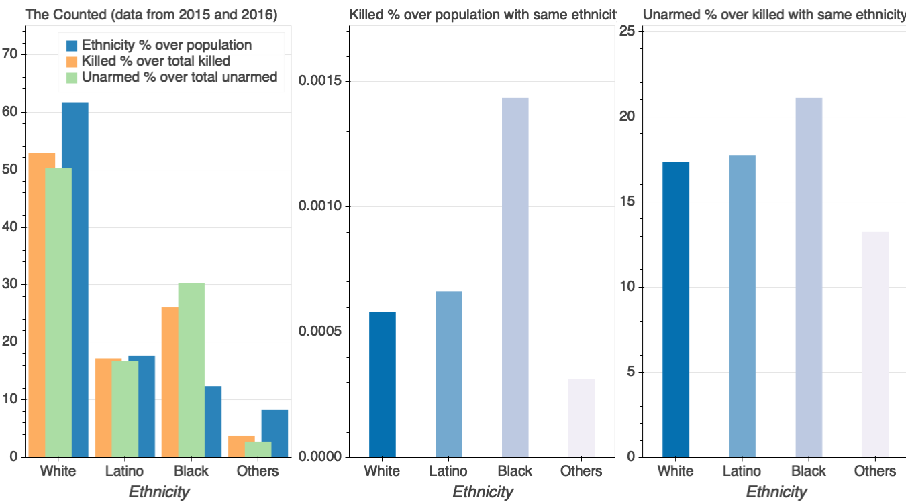

# The Counted Visualisation
Interactive visualisation of [The Counted](https://www.theguardian.com/us-news/ng-interactive/2015/jun/01/about-the-counted) data, gathered by The Guardian between 2015 and 2016.

> The Counted is a project working to count the number of people killed by police and other law enforcement agencies in the United States throughout 2015 and 2016, to monitor their demographics and to tell the stories of how they died.

I got the idea from this [BuzzFeed article](https://www.buzzfeednews.com/article/peteraldhous/race-and-police-shootings) and [git repository](https://github.com/BuzzFeedNews/2015-12-fatal-police-shootings).

I use Python Bokeh library to generate the plot in html format, the result can be seen here.

